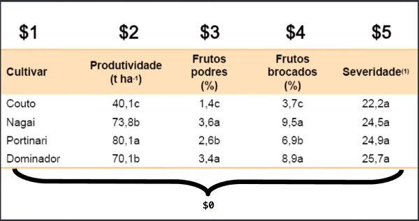

[](/README.md/)

# Comando awk

### Conceitos Gerais
Dificilmente não terá o awk no seu linux, para sabe sua versão bsta digitar o comando `# awk --version`
caso não tenha, será necessário instalar com o comando `sudo apt install gawk`
com o comando `which awk` 
```
[root@localhost Fulano]# which awk
/bin/awk
[root@localhost Fulano]# which gawk
/bin/gawk
[root@localhost Fulano]#  

```
- **Apresentação**  
A linguagem de programação **awk** foi criada em 1977 e a palavra awk são as iniciais dos nomes dos criadores da linguagem (Aho, Weinberger e Kernighan).
- **Introdução**  
A linguagem é interpretada linha por linha e tem o objetivo de deixar os scripts mais poderosos
- **O primeiro awk**  
Estrutura do **awk** envolve estes 4 ou 5 opções, a depender do caso  
`awk[ -F separador ][ -v var=valor ][ 'programa' ][ -f arquivo-com-programa ][ arquivo... ]`  
Você pode utilizar o awk de 4 maneiras  
  **1 - Diretamente no terminal** 
```
  [root@localhost bin]# awk 'BEGIN {print "Meu primeiro strip em AWK"}'
Meu primeiro strip em AWK
```
  **2 - No terminal, mas lendo um arquivo separado** 
```
  [root@localhost Fulano]# echo 'meu primeiro script em AWK' > primeiro.txt
[root@localhost Fulano]# awk '{print}' primeiro.txt
meu primeiro script em AWK
```
  **3 - No terminal, mas lendo um arquivo separado e o programa separado**
```
  [root@localhost Fulano]# echo 'meu primeiro script em AWK' > primeiro.txt
[root@localhost Fulano]# echo '{print}' > programa
[root@localhost Fulano]# cat programa
{print}
[root@localhost Fulano]# awk -f programa primeiro.txt
meu primeiro script em AWK
```
  **4 - Tudo num programa executável awk**  
```
  [root@localhost Fulano]# echo -e '#!/usr/bin/awk -f\nBEGIN {print "Meu primeiro script AWK"}' > programa.awk
  [root@localhost Fulano]# cat programa.awk
  #!/usr/bin/awk -f
  BEGIN {print "Meu primeiro script AWK"}
  [root@localhost Fulano]# chmod +x programa.awk
  [root@localhost Fulano]# ./programa.awk
  Meu primeiro script AWK
  #OBS: o -f após o /usr/bin/awk é necessário para rodar o programa caso contrario para rodar, teremos que colocar o -f na hora da execução
  # ex: awk -f programa.awk 
```
- **Declarando variáveis**  
As variáveis no AWK possuem diversos seguimentos, O AWK classifica cada coluna como um número sendo que o número zero é o próprio arquivo, ou seja, utilizar a variável zero é a mesma coisa de não usar. exemplo
  
Além das variáveis definidas pelo programador  
```
[root@localhost Fulano]# awk 'BEGIN { minha_var = "Legal, aprender AWK!" ; print minha_var}'
Legal, aprender AWK!
``` 
também há **variaveis internas**  que são utilizadas pelo awk, são elas:
|Variavel|descrição|
|:---:|---|
|ARGV|Valor contendo os parâmetros para o programa|
|FILENAME|Nome do arquivo de entrada atual|
|FS|Separados de campos. Seu padrão é brando e TAB|
|NR|Quantidade de registros do arquivo em processamento|
|OFMT|Formato de saída para números. Seu padrão é %.6g|
|OFS|Separados de campos na saída. Seu padrão é branco|
|ORS|Separador dos registros de saída. Seu padrão é newline|
|RS|Separador de registroos de entrrada. Seu pad~rao é newline|
|FNR|Registros em linhas|

Para imprimir o arquivo inteiro, se utilizarmos o {print $0} dá no mesmo
```
[root@localhost Fulano]# awk '{print}' tabela.txt
Empresa contato pais
LTDA    Fulano  Brasil
SA      Ciclano Espanha
```
Se a gente quiser imprimir apenas a primeira coluna
```
[root@localhost Fulano]# awk '{print $1}' tabela.txt
Empresa
LTDA
SA
```
Se a gente quiser imprimir 2,3 inverter a ordem, duplicar a coluna, basta concatenar {print $3$1$2}
```
[root@localhost Fulano]# awk '{print $3$2$1}' tabela.txt
paiscontatoEmpresa
BrasilFulanoLTDA
EspanhaCiclanoSA
```
Observe que não tem separação entre as colunas  
Então podemos concatenar separadores, ou simplesmente usar a virgula {print $3,$2,$1}
```
[root@localhost Fulano]# awk '{print $3" - "$2" - "$1}' tabela.txt
pais - contato - Empresa
Brasil - Fulano - LTDA
Espanha - Ciclano - SA
```
Você também pode usar o awk assim
```
[root@localhost Fulano]# ls -l /etc
total 2284
-rw-r--r--  1 root root        12 Nov 26  2020 adjtime
-rw-r--r--  1 root root      1529 Jun 23  2020 aliases
drwxr-xr-x  2 root root      1313 Dec 19  2020 alternatives
...
[root@localhost Fulano]# ls -l /etc | awk '{print $9}'
 
adjtime
aliases
alternatives
...
```
Porém se eu imprimir a coluna 1 e 2, eu tenho na linha 1  **total 2284** mas eu posso tirar usanod o (NR)
```
[root@localhost Fulano]# ls -l /etc | awk '(NR > 1){print $1" - "$9}'
-rw-r--r-- - adjtime
-rw-r--r-- - aliases
drwxr-xr-x - alternatives
``` 
Podemos escolher o separados também com o comando (OFS), e podemos usar /t para ganhar mais espaço
```
[root@localhost Fulano]# awk 'OFS = "\t\t > \t\t " (NR > 1) {print $2,$3}' tabela.txt
contato          >               0pais
Fulano           >               1Brasil
Ciclano          >               1Espanha
```
Podemos definir o separador para a consulta do arquivo
```
[root@localhost Fulano]# awk 'FS = ":"  {print $1,$7}' /etc/passwd
root:x:0:0:root:/root:/bin/bash
bin /sbin/nologin
daemon /sbin/nologin
```
Porém não funcionou na primeira linha, então teremos que fazer desta forma
```
[root@localhost Fulano]# awk 'BEGIN {FS = ":"} {print $1,$7}' /etc/passwd
root /bin/bash
bin /sbin/nologin
daemon /sbin/nologin
```
ou também
```
[root@localhost Fulano]# awk '{FS = ":"} (NR > 1) {print $1,$7}' /etc/passwd
bin /sbin/nologin
daemon /sbin/nologin
adm /sbin/nologin
```
Imprimir o numero da linha também é possivel
```
[root@localhost Fulano]# awk 'OFS = " \t\t > \t\t "{FS = ":"} (NR > 1) {print FNR,$1,$7}' /etc/passwd
2 bin             >               /sbin/nologin
3 daemon                  >               /sbin/nologin
4 adm             >               /sbin/nologin
```
Imprimir apenas uma linha
```
[root@localhost Fulano]# awk 'OFS = " \t\t > \t\t "{FS = ":"} (NR == 8) {print FNR,$1,$7}' /etc/passwd
8 halt            >               /sbin/halt
```
Imprimir apenas as ultimas linhas (nete caso as ultimas 5)
```
[root@localhost Fulano]# tail -n 5 /etc/passwd
qemu:x:107:107:qemu user:/:/sbin/nologin
kojibuilder:x:989:988::/builddir:/bin/bash
chrony:x:988:987::/var/lib/chrony:/sbin/nologin
sshd:x:74:74:Privilege-separated SSH:/var/empty/sshd:/sbin/nologin
pesign:x:987:986:Group for the pesign signing daemon:/var/run/pesign:/sbin/nologin
```
também é possivel começar a contagem da linha de outro numero (neste caso 1 +2 = 3)
```
[root@localhost Fulano]# awk 'OFS = " \t\t > \t\t "{FS = ":"} {print FNR + 2,$1,$7}' /etc/passwd
3                >               root:x:0:0:root:/root:/bin/bash                 >
4                >               bin             >               /sbin/nologin
5                >               daemon                  >               /sbin/nologin
6                >               adm             >               /sbin/nologin
```
Ou FNR + FNR para contar só em números pares
```
[root@localhost Fulano]# awk 'OFS = " > "{FS = ":"} {print FNR + FNR,$1,$7}' /etc/passwd
2 > root:x:0:0:root:/root:/bin/bash >
4 > bin > /sbin/nologin
6 > daemon > /sbin/nologin
```

- **Passando parâmetros**  
Utilizando as variaveis **ARGV**
```
[root@localhost Fulano]# vi argumentos.awk
#!/usr/bin/awk -f
BEGIN {
 print "O awk e muito " ARGV[1] " e também é " ARGV[2]
}
:wq
[root@localhost fulano]# ./argumentos.awk legal massa
O awk e muito legal e também é massa
```
Poderia ser assim também, jogar para dentro de uma variável e depois imprimir a variavel
```
[root@localhost Fulano]# vi argumentos.awk
#!/usr/bin/awk -f
BEGIN {
 conceito = "O awk e muito " ARGV[1] " e também é " ARGV[2]
 print conceito
}
:wq
[root@localhost fulano]# ./argumentos.awk legal massa
O awk e muito legal e também é massa
```
**Expressõesregulares**
Existem 2 formas basicas de trabalhar com expressões regulares em **awk**, o "^" significa começa com
```
[root@localhost fulano]# awk '/t/ {print}' tabela.txt
Tomate doce
torta salgada
[root@localhost fulano]# awk '/^t/ {print}' tabela.txt
torta salgada
[root@localhost fulano]# awk '/^t|A/ {print}' tabela.txt
Abacaxi doce
torta salgada
[root@localhost fulano]# awk '/^[Aa]|[Tt]/ {print}' tabela.txt
Abacaxi doce
alface salgado
Tomate doce
torta salgada
[root@localhost fulano]# awk 'BEGIN {FS = " "}/^[Aa]|[Tt]/ {print $1}' tabela.txt
Abacaxi
alface
Tomate
torta
# imprima a primeira coluna porém com palavras que comecem com a letra "d" e que etejam na segunda coluna
[root@localhost fulano]# awk 'BEGIN {FS = " "} $2 ~ "^d" {print $1}' tabela.txt
Abacaxi
Tomate
[root@localhost fulano]# awk 'BEGIN {FS = " "} $2 ~ "^d|s" {print $1}' tabela.txt
Abacaxi
alface
Tomate
torta
```


- **Inserindo comentário com awk**
- **O que é e o que faz o begin e o end?**
- **Tipos de saidas**
- **Os padrões usados pelo awk**
- **Matemática em awk**
Começamos com operações simples
```
#!/usr/bin/awk -f
BEGIN {
  print "8 + 8 = " 8 + 8
  print "3 - 2 = " 3 - 2
  print "12 / 2 = " 12 / 2
  print "3 * 5 = " 3 * 5
}
[root@localhost fulano]# ./matematica.awk
8 + 8 = 16
3 - 2 = 1
12 / 2 = 6
3 * 5 = 15
```
Lembrando que podemos passar os argumentos usando a variavel **ARGV**
sqrt = raiz quadrada
cos = cosseno
sin = seno
exp = exponencial
log = logaritmo
```
#!/usr/bin/awk -f
BEGIN {
  print "8 + 8 = " 8 + 8
  print "3 - 2 = " 3 - 2
  print "12 / 2 = " 12 / 2
  print "3 * 5 = " 3 * 5
  print "A raiz quadrada de " ARGV[1] " é = " sqrt(ARGV[1])
}
[root@localhost fulano]# ./matematica.awk 25
8 + 8 = 16
3 - 2 = 1
12 / 2 = 6
3 * 5 = 15
A raiz quadrada de 25 é = 5
```
Podemos colocar uma condição if para printar uma mensagemque o usuário não digitou numero
```
#!/usr/bin/awk -f
BEGIN {
  if(ARGV[1] == 0){
     print "Informe o número"
  }
  else{
  print "8 + 8 = " 8 + 8
  print "3 - 2 = " 3 - 2
  print "12 / 2 = " 12 / 2
  print "3 * 5 = " 3 * 5
  print "A raiz quadrada de " ARGV[1] " é = " sqrt(ARGV[1])
  }
}
[root@localhost fulano]# ./matematica.awk
Informe o número
[root@localhost fulano]# ./matematica.awk 25
8 + 8 = 16
3 - 2 = 1
12 / 2 = 6
3 * 5 = 15
A raiz quadrada de 25 é = 5
```
Caso o numero da raiz seja quebrad e você quera ver apenas o numero inteiro, basta usar o **int**
```
print "A raiz quadrada de " ARGV[1] " é = " int( sqrt(ARGV[1]) )
``` 

###loop while
```
#!/usr/bin/awk -f
BEGIN {
 num = 0
 while (num <= 5){
 print num
 num += 1
 }
}
[root@localhost fulano]# ./while.awk
0
1
2
3
4
5
```
###loop for
```
#!/usr/bin/awk -f
BEGIN {
 for( i = 0; i <= 5; i++){
 print " o numero i é: " i
 }
}
[root@localhost fulano]# ./for.awk
 o numero i é: 0
 o numero i é: 1
 o numero i é: 2
 o numero i é: 3
 o numero i é: 4
 o numero i é: 5
```
###Arrays
Aqui temos uma variável "a" com 3 sistemas operacionais, porém, "a" continua sendo uma variável comum, para transforma-la em uma array, usamos o comando **split** dentro dos parenteses, a gente seleciona a variavel, um nome da array e o separador.
```
#!/usr/bin/awk -f
BEGIN{
        a = "GNU/Linux Darwin/macOS Microsoft/Widows"
        split(a, array, " ")
        print array[1] 
}
[root@localhost fulano]# ./array.awk
GNU/Linux
```
Podemos usar o for nesta array também
```
#!/usr/bin/awk -f
BEGIN{
  a = "GNU/Linux Darwin/macOS Microsoft/Widows"
  split(a, array, " ")
  for(i = 0; i < length(array); i++){
  print array[i]
  }
}
[root@localhost fulano]# ./array.awk
 
GNU/Linux
Darwin/macOS
Microsoft/Widows
```

- **Exemplos**
Temos um arquivo com valores sem especificação, queremos colocar isso neles ao lado de cada um
testado FNR com outros valores e funcionou também
```
[root@localhost fulano]# cat calculos.txt
87 52 21
23 12 45
56 87 89
21 23 56
```
```
[root@localhost fulano]# cat info.awk
#!/usr/bin/awk -f
BEGIN{
  FNR == 2
}
{
  print "Qtd: "$1" - Valor: "$2" - Especificação: "$3
}
```
```
[root@localhost fulano]# ./info.awk calculos.txt
Qtd: 87 - Valor: 52 - Especificação: 21
Qtd: 23 - Valor: 12 - Especificação: 45
Qtd: 56 - Valor: 87 - Especificação: 89
Qtd: 21 - Valor: 23 - Especificação: 56
```
Agora colocaremos nomes nas colunas
```
[root@localhost fulano]# awk 'BEGIN {print "QT VA ES"}1' calculos.txt
QT VA ES
87 52 21
23 12 45
56 87 89
21 23 56
```
Agora quemeros a somatória dos valores das colunas
```
[root@localhost fulano]# cat info.awk
#!/usr/bin/awk -f
BEGIN{
  FNR == 0
}
{
  print "Qtd: "$1" - Valor: "$2" - Especificação: "$3" = Total: "$1+$2+$3
}
[root@localhost fulano]# ./info.awk calculos.txt
Qtd: 87 - Valor: 52 - Especificação: 21 = Total: 160
Qtd: 23 - Valor: 12 - Especificação: 45 = Total: 80
Qtd: 56 - Valor: 87 - Especificação: 89 = Total: 232
Qtd: 21 - Valor: 23 - Especificação: 56 = Total: 100
```
Imprimindo um item com base na linha e coluna
```
#!/usr/bin/awk -f
BEGIN{
  FNR == 0
}
{
  print "Qtd: "$1" - Valor: "$2" - Especificação: "$3" = Total: "$1+$2+$3
}
[root@localhost fulano]# cat calculos.txt
87 52 21
23 12 45
56 87 89
21 23 56
[root@localhost fulano]# awk -v Linha=3 -v coluna=2 'FNR == Linha {print $coluna}' calculos.txt
87
```
Eliminando informações duplicadas
```
[root@localhost fulano]# cat duplicados.txt
87 52 21
23 12 45
56 87 89
21 23 56
87 52 21
23 12 45
56 87 89
21 23 56
87 52 21
23 12 45
56 87 89
21 23 56

[root@localhost fulano]# awk '!x[$0]++' duplicados.txt
87 52 21
23 12 45
56 87 89
21 23 56

```
- **Links Úteis (para voar no awk)**
[Tutorial básico de AWK](https://terminalroot.com.br/2014/12/tutorial-basico-de-awk.html)
[AWK Wikipédia](https://pt.wikipedia.org/wiki/AWK)
[comp.lang.awk FAQ](http://www.faqs.org/faqs/computer-lang/awk/faq/)
[awk - alguns exemplos de uso, scripts e linha de comando](http://www.zago.eti.br/script/awk.html)


_...Bora estudar pra valer..._


