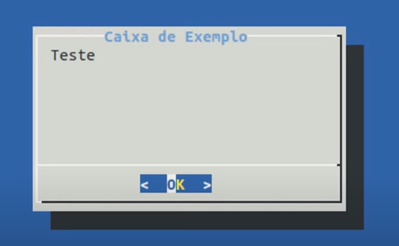
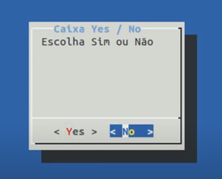
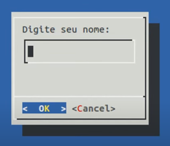
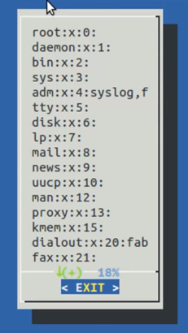
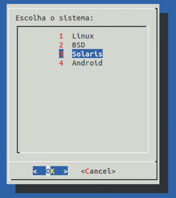
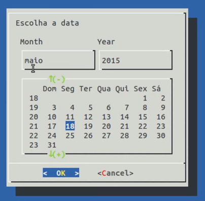
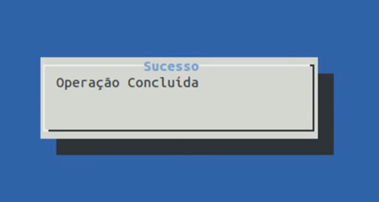
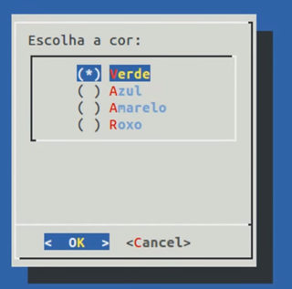

# 29 - Criando caixas de diálogo TUI com dialog

Por padrão, o dialog não vem instalado no linux, é necessário instalar atravém do comando `~# apt get install dialog`.  
Este comando, utiliza varios parâmetros de linha de comandopara determinar o tipo do widgetde janela que a gente vai criar, então ele trabalha com conceito de widget, cada widget cprresponde a uma função ou a um tipo de janela que o dialog pode criar, então a gente dtem widget para trabalhar por exemplo com checklist, com formulário, com caixa de informações, menus, calendários, listagem de botões de raio e outras coisas mais.
mais opções no site http://www.bosontreinamentos.com.br/shell-script/shell-scripting-criando-caixas-de-dialogo-tui-com-dialog/  
A sintaxe é simples:
```
dialog --widget parâmetros
```
**Exemplo**  
este exemplo pode ser feito direto na linha de comando, porém é util usar dentro de um script
```
~$ dialog --title "titulo da caixa" --msgbox "teste" 10 35
``` 



Se pressionar **ok** ele sai e volta para o prompt de comando  
Os widgets, fornecem a saida em duas formas usando o erro padrão **STDERR8** ou utilizando o codigo de status de saida, o codigo de status determina qual botão foi selecionado pelo usuário, então se o botão for **yes** ou **OK**, o status de saida será o número "0", já se for um botão **cancel** ou **no**, o comando dialog retorna o status de comando igual a "1", é assim que o dialog sabe se o usuário escolheu o **yes** ou o **no**.  

**Exemplo2**
```
~$ dialog --title "caixa Yes / No" --yesno "Escolha sim ou não" 10 25 
```



Tamb~em podemos usar uma caixa inputbox, aonde o usuário digire uma informação, e para armazenar esta informação, precisaremos ccriar uma variável.  

**Exemplo3**
```
~$ nome=$(dialog --inputbox "Digite seu nome: "10 25 --stdout)
```



A variavel **nome** armazenou a informação digitada, podemos verificar no comando:   
```
~$ echo $nome
Fulano
```

Também podemos exibir na caixa de dialogo, o conteudo de um arquivo de texto.  

**Exemplo4**
```
~$dialog --textbox /etc/group 20 20
```



Coma a setas, podemos rolar o arquivo para cima e para baixo.  

Um widget que é muito util, é o widget "menu", para construir menus, ele permite criar um menu de itens selecionaveis a partir de uma tag de seleção e um texto descritivo em cada item.  

**Exemplo 5**

Começamos criando uma variável
```
~$ sistema=$(dialog --menu "Escolha o sistema: " 20 35 15 \
> 1 "Linux" \
> 2 "BSD" \
> 3 "Solaris" \
> 4 "Android" --stdout)
```


O 15 é a dimenção de dentro da caixa, caberia até 15 itens no menu

Como selecionamos solaris, a variavel sistema está com o conteudo solaris dentro dela.  

```
~$ echo $sistema
3
```
Veja que o conteúdo é o numero e não o nome, para ficar armazenado o nome, basta inverter no script o nome com o número.  

O calendário é outro widget interessante, vamos armazenar a data que o usuário vai e scolher entro de um calendário, pra isso vamos criar uma variável chamada data.  

**Exemplo6**

```
~$ data=$(dialog --calendar "Escolua a data" 0 0 --stdoit)
```
Foi colocado as dimensões da caixa "0 0" para que possa ser ajustada automaticamente



```
echo $data
18/05/2015
```

O infobox é um widget simples, ele exibe uma mensagem sem esperar uma resposta do usuário

**Exemplo7**

```
~$ dialog --title "sucesso" --infobox "Operação concluida" 5 35; sleep 4; clear
```

Como o infobox não tem botão para o usuário selecionar e sair, foi utilizado o sleep para a caixa ficar um tempo "4" e depois fechar automaticamente, e foi necessário usar o ";" para encerrar o dialog, pois o sleep não faz parte do dialog, e o comando clear lmpa a tela 




O radiolist é um widget que permite criar uma listagem de elementos que o usuário pode selecionar como se fosse um botão de rádio, ele pode selecionar apenas um item por vez na lista, também é possivel criar um checklist para criar varios de uma vez.

**Exemplo8**  
```
~$ itens=$(dialog --radiolist "Escolha a cor" 15 30 4\
> "Verde " "" OFF \
> "Azul" "" OFF
> "Amarelo" "" ON
> "Roxo" "" OFF --stdout)
```



Com esta ordem, o conteúdo da variável será a cor
```
~$ echo $itens
verde
```


|Topico Anterior|Próximo Topico|
|:---|---:|
|[28 - Criando Funções em Shell Scripting](funcaoShell.md)]|[30 - Declaração break - encerrando loops prematuramente](declaracaobreak.md)|
